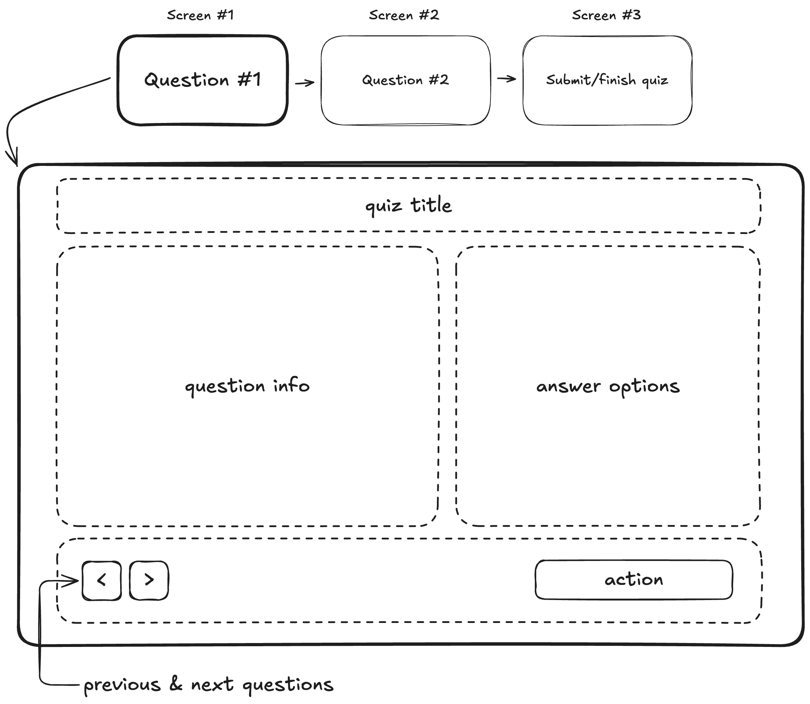

# Quiz UI

### Instructions to run

1. Clone the repository: `git clone https://github.com/openwell/frontend-tech-assignment.git`
2. Navigate to the project directory: `cd frontend-tech-assignment`
3. Install dependencies: `npm install`
4. Start the development server: `npm run start`
5. Visit the app at [http://localhost:4200](http://localhost:4200)

### Time spent

Approximately 2.8 hours were spent on this assignment, including setup, component development, state management, testing, and lint fixes.

### Trade-offs made and improvements with more time

Trade-offs:
- Used static JSON data instead of a dynamic backend for simplicity.
- Focused on core functionality; some edge cases (e.g., validation) were not fully addressed.

Improvements with more time:
- Implement better error handling and user feedback (e.g., loading states, error messages).
- Better UI.
- Optimize performance for larger quizzes (e.g., lazy loading questions).
- Fix broken tests and lint error

## Assignment

Build a small quiz interface based on the wireframe below. The focus is on component design, state management, and code quality.

Functional requirements:

- Header with quiz info (e.g. title).
- Question information area to display instructions (text required, images or videos optional).
- Answer options for a “select all that apply” type question:
  - The user must be able to select multiple options.
  - The selection for each question should be preserved when navigating back and forth.
- Navigation controls:
  - Buttons to move to the previous and next question.
- A “review & submit” page:
  - After the last question, show a dedicated view to submit the answers / finish the quiz.
  - On submit, show a confirmation message.

You may define the quiz and the quiz questions in a static JSON file (no backend is required).

## Tech stack

Preferably use Ember (you can start from this repo). If you’re not familiar with Ember, you may use another modern framework (React, Vue, Svelte, etc.).

Feel free to use whatever tools you’re comfortable with (IDE, workflow, AI assistants/LLMs), just as you would in your normal day-to-day work.

## Timebox

You should aim to spend **no more than 3 hours**. If you don’t finish everything, that’s fine. We’ll talk about trade-offs during the interview.

## How to submit

Send a link to the repo, which should contain a short `README.md` with:

- Instructions to run.
- Time spent.
- Any trade-offs made and what you would improve with more time.

(if you start from this repo, please don't create a public fork)

---

# ember-latest (info to run the ember app)

This README outlines the details of collaborating on this Ember application.
A short introduction of this app could easily go here.

## Prerequisites

You will need the following things properly installed on your computer.

- [Git](https://git-scm.com/)
- [Node.js](https://nodejs.org/) (with npm)
- [Google Chrome](https://google.com/chrome/)

## Installation

- `git clone <repository-url>` this repository
- `cd ember-latest`
- `npm install`

## Running / Development

- `npm run start`
- Visit your app at [http://localhost:4200](http://localhost:4200).
- Visit your tests at [http://localhost:4200/tests](http://localhost:4200/tests).

### Code Generators

Make use of the many generators for code, try `npm exec ember help generate` for more details

### Running Tests

- `npm run test`

### Linting

- `npm run lint`
- `npm run lint:fix`

### Building

- `npm exec vite build --mode development` (development)
- `npm run build` (production)

### Deploying

Specify what it takes to deploy your app.

## Further Reading / Useful Links

- [ember.js](https://emberjs.com/)
- [Vite](https://vite.dev)
- Development Browser Extensions
  - [ember inspector for chrome](https://chrome.google.com/webstore/detail/ember-inspector/bmdblncegkenkacieihfhpjfppoconhi)
  - [ember inspector for firefox](https://addons.mozilla.org/en-US/firefox/addon/ember-inspector/)
